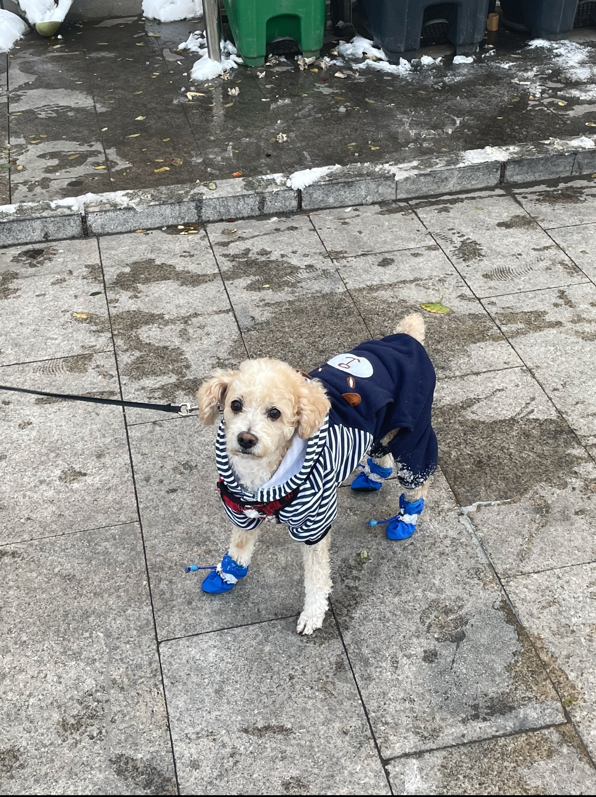
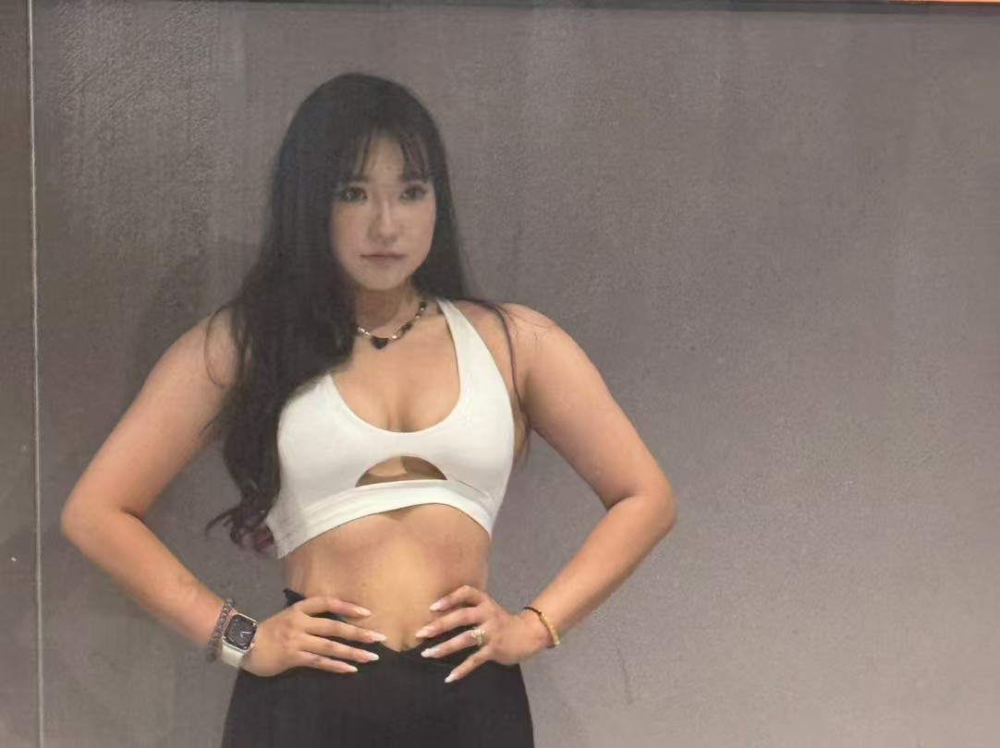

# About Me

Hi! I’m **Bing Li**, currently pursuing my Master’s in **Biostatistics** at **Columbia University**.  
My academic path bridges data science, public health, and statistical computing.  
I’m especially interested in applying machine learning and data visualization to real-world biomedical data.

## Academic Background
- **M.S. in Biostatistics**, Columbia University, Mailman School of Public Health *(expected 2027)*  
- **B.S. in Information Management and Information Systems**, Beijing University of Technology

## Research & Work Interests
- Multimodal data analysis and fusion  
- Predictive modeling for biomedical research  
- Public opinion and health informatics  
- Interactive dashboards for data storytelling  

## Skills
- **Programming:** R, Python, SQL, Java  
- **Statistical tools:** Stata, SAS, SPSS  
- **Other tools:** Git/GitHub, Neo4j, Excel  

---

## Outside the Lab

Before diving into data and models, I like to spend time with my little dog — **Bengbeng** 🐶.  
He brings endless joy (and sometimes chaos) to my study days!

  

## Outside the Lab
I have a background in Chinese ethnic dance (Level 10 certification) and love combining discipline from dance with the logic of data science. I also enjoy fitness, photography, cooking, and exploring NYC.

<table style="border-collapse:separate; border-spacing:24px 0; margin-top:8px;">
  <tr>
    <td style="text-align:center; vertical-align:top;">
      
       
      Chinese ethnic dance has been part of my life since childhood.
    </td>
    <td style="text-align:center; vertical-align:top;">
      
       
      Fitness helps me maintain both physical and mental strength.
    </td>
  </tr>
</table>

---

> 📫 **Email:** bli3175@columbia.edu  
> 💻 **GitHub:** [BonnieLee3175](https://github.com/BonnieLee3175)